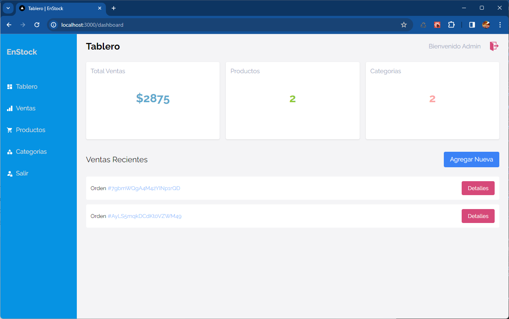
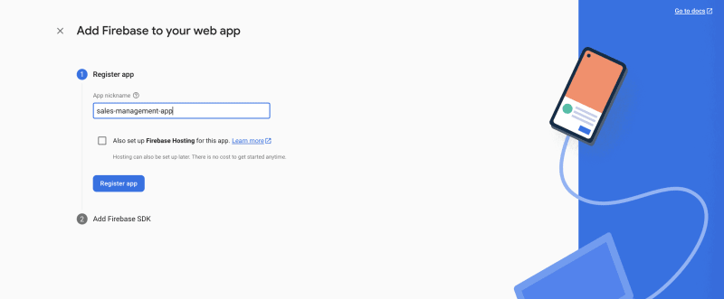
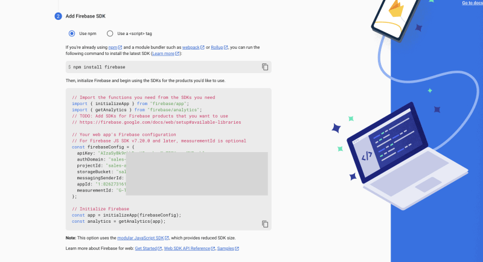
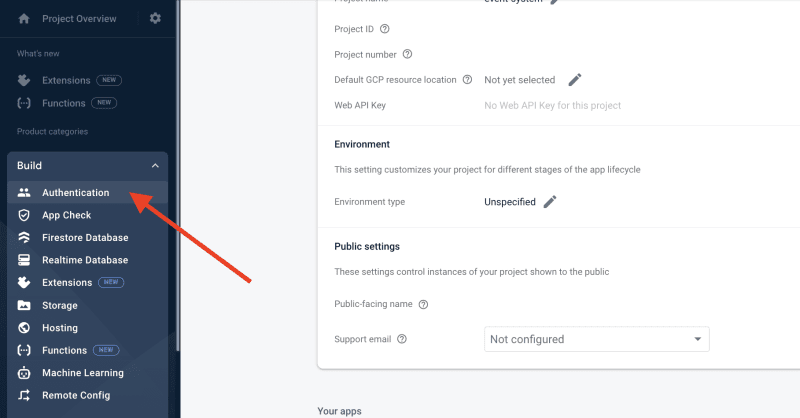
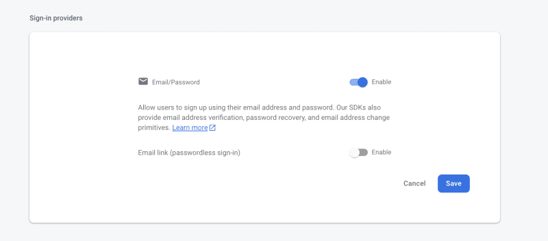
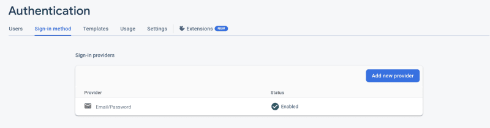
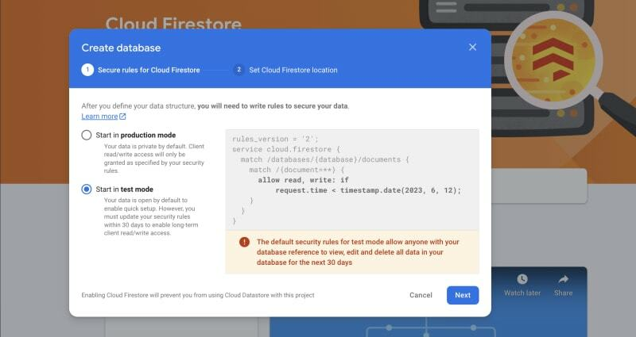
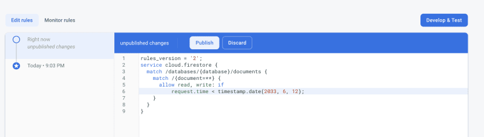
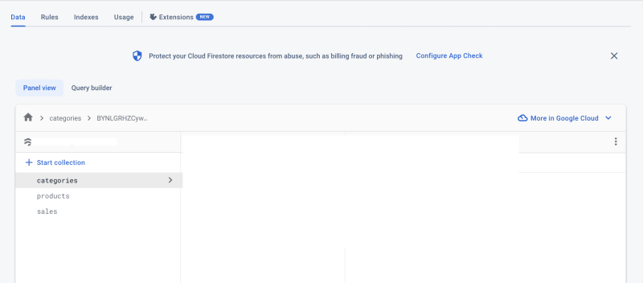

# Sales management application with Next.js and Firebase

### The application does the following: 
- **authenticates** users via Email and Password with Firebase,
- allows a user (cashier or store owner) to create various categories for the products,
- add and delete products from the application, and
- record and track sales made daily.

## How-to Guide
[Read article on DEV](https://dev.to/arshadayvid/how-i-built-a-sales-management-app-with-nextjs-13-typescript-and-firebase-16cb)



```text
npm install firebase
```











## Installation
- Clone the project repository. Don't forget to star the repo 😉
- Run `npm install` to install its dependencies.
- Start the development server by running `npm run dev`

## Tools
- [NextJS 13](https://nextjs.org/docs)
- [Tailwind CSS](https://tailwindcss.com/)
- [Firebase](https://firebase.google.com)
- [React Icons](https://react-icons.github.io/react-icons)
